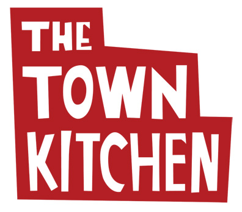

WORK-IN-PROGRESS

## The Town Kitchen

An Android app for [The Town Kitchen](http://thetownkitchen.com) that:

1. Takes and processes meal orders (currently available via website only), including verification within pre-defined geographic area and disseminating orders to other individuals.
2. Estimates and tracks meal deliveries based on driver's location
3. Reviews meals (gives feedback) and contact support

## User Stories

TO-DO

## Acknowledgements

This app was made by [Paulina Ramos](https://github.com/paulinar), [Marina Murashev](https://github.com/marinamurashev), and [Xiangli Dai](https://github.com/XiangliDai).

It uses open source libraries, such as:

 * xx

## Contributing

Please fork this repository and contribute back using
[pull requests](https://github.com/paulinar/the-town-kitchen/pulls).

Any contributions, large or small, major features, bug fixes, additional
language translations, unit/integration tests are welcomed and appreciated
but will be thoroughly reviewed and discussed.
