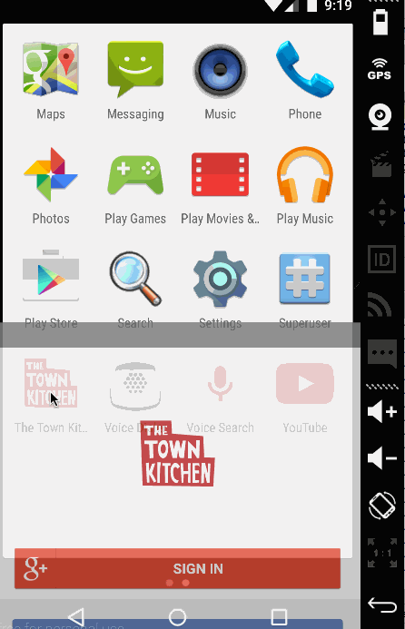

WORK-IN-PROGRESS

## The Town Kitchen

[The Town Kitchen](http://thetownkitchen.com) is a community-driven food company that connects chefs, youth, educators, growers, and artisans to corporate and individual consumers. The Town Kitchen community addresses a need within the Oakland and San Francisco area for locally-sourced lunches, as well as fair-wage jobs and job training programs for local youth.

This Android app will:

1. Take and process meal orders (currently available via website only), including verification within pre-defined geographic area and disseminating orders to other individuals.
2. Estimate and track meal deliveries based on driver's location
3. Review meals (give feedback) and contact support

## User Stories

 * [x] Login with Google+ account via OAuth
  	* [x] *Optional:* Login with username/password and/or facebook
 * [x] User can see list of available meals for a particular day.
  	* [ ] User can open a calendar modal and select other days to view meals.
 * [x] User can select quantities of each meal they want. 
   	* [x] User can see how many meals are in their cart by the cart icon on the top-righthand corner of the actionbar.
 * [x] User can select delivery location. (Defaults to user's current location using gps)
    * [x] User can change delivery location by dragging the location pin.
 * [x] User can see the order summary before submitting the order.
    * [x] User can go back and edit their order.
   	* [x] *Optional:* User can enter a coupon code for their order.
 * [x] User can enter their credit card information.
   	* [x] User is given option to save their credit card information so they won't have to enter it again.
 * [x] User sees a "Your order's on its way!" message and graphic for a short duration after submitting order.
 * [x] User can submit feedback once their order has arrived.

## Mockups

View mockups [here](https://moqups.com/jemoonette/6pPEZtek/p:ad592cb44).

## Video Walkthrough

Walkthrough of all user stories:

GIF created with [LiceCap](http://www.cockos.com/licecap/).

## Acknowledgements

This app was made by [Paulina Ramos](https://github.com/paulinar), [Marina Murashev](https://github.com/marinamurashev), and [Xiangli Dai](https://github.com/XiangliDai).

It uses the following open source libraries:

* [scribe-java](https://github.com/fernandezpablo85/scribe-java) - Simple OAuth library for handling the authentication flow.
* [Android Async HTTP](https://github.com/loopj/android-async-http) - Simple asynchronous HTTP requests with JSON parsing
* [codepath-oauth](https://github.com/thecodepath/android-oauth-handler) - Custom-built library for managing OAuth authentication and signing of requests
* [Picasso](https://github.com/square/picasso) - Used for async image loading and caching them in memory and on disk.
* [ActiveAndroid](https://github.com/pardom/ActiveAndroid) - Simple ORM for persisting a local SQLite database on the Android device
* [Google Play Services](http://developer.android.com/google/play-services/maps.html) - Contains the interfaces to the individual Google services

## Contributing

Please fork this repository and contribute back using
[pull requests](https://github.com/paulinar/the-town-kitchen/pulls).

Any contributions, large or small, major features, bug fixes, additional
language translations, unit/integration tests are welcomed and appreciated
but will be thoroughly reviewed and discussed.
